# KeyCloak SAML integration with Harmony CONNECT

## Goal

* allow user management and authorization in KeyCloak Identity Provider
* integrate with Harmomy CONNECT using Generic SAML integration
* authorize Harmony corporate apps access based on groups managed in KeyCloak

## Required inputs

* DNS domain used by corporate users to login into Harmomy Connect - e.g. **ra.klaud.online** - usernames are in format *user@ra.klaud.online*
* **ability to manage DNS for this domain** as domain ownership is proved by adding TXT record with value from Harmony Connect integration process

## Adding Identity Provider to Harmony CONNECT

* visit Harmony CONNECT on Infinity Portal under [Settings / Identity Provider](https://portal.checkpoint.com/dashboard/connect#/settings/identity-provider)
* configure new Identity Provider with **CONNECT NOW** button

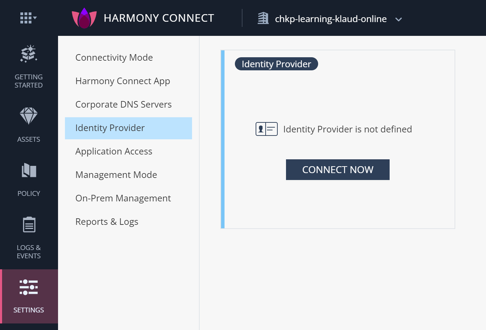

* choose **Generic SAML Provider**
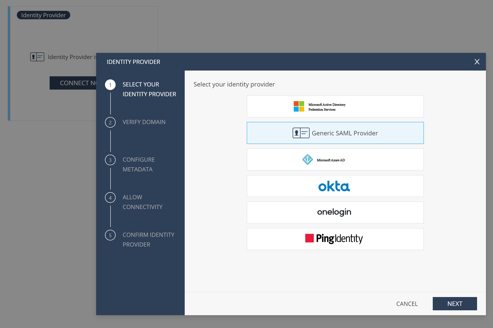

* add TXT record to your DNS for domain being added - e.g. **ra.klaud.online**

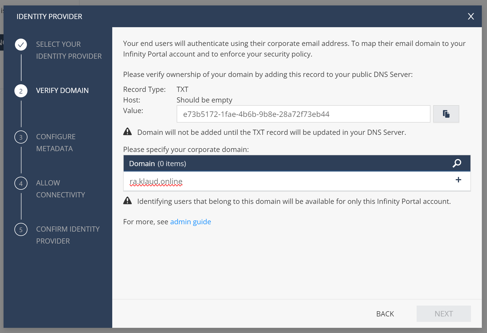

* in your DNS configuration tool:
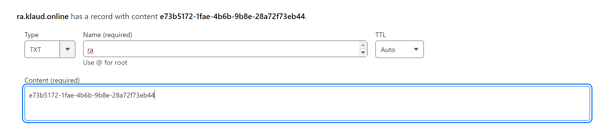

* go to KeyCloak
* add new realm to KeyCloak - e.g. **cpdemo**
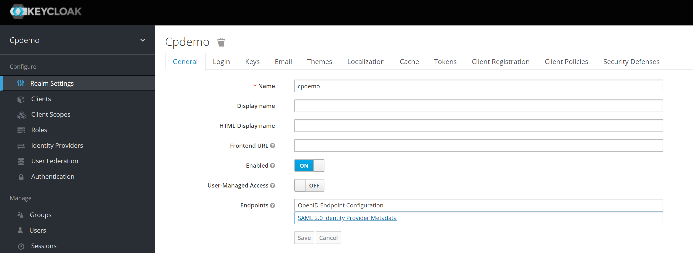

* visit Realm Settings - look under Endpoints
* click Endpoint  **SAML 2.0 Identity Provider Metadata** and save XML to local file - e.g. **cpdemo-saml.xml** (it can be done by using URL on command line like `curl https://keycloak-8d0ebe.azurewebsites.net/auth/realms/cpdemo/protocol/saml/descriptor > cpdemo-saml.xml` as well - use your own real URL!)

* back in Harmomy CONNECT - select and upload XML file - e.g. **cpdemo-saml.xml**
* it is confirmed by showing correct Service URL

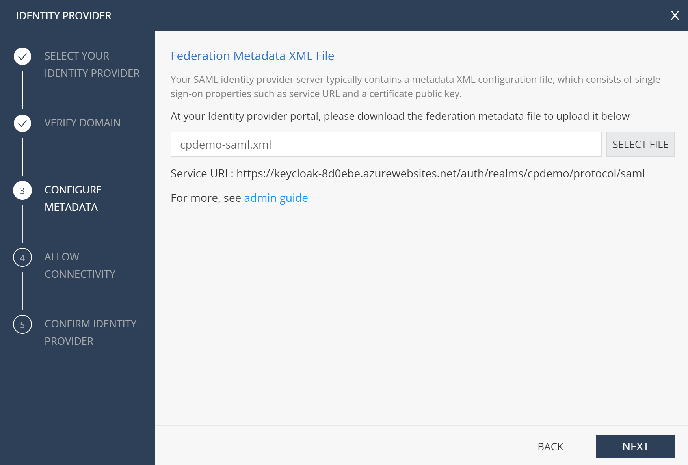

* continue with Next
* note Entity ID and Reply URL - we will need them on KeyCloak side
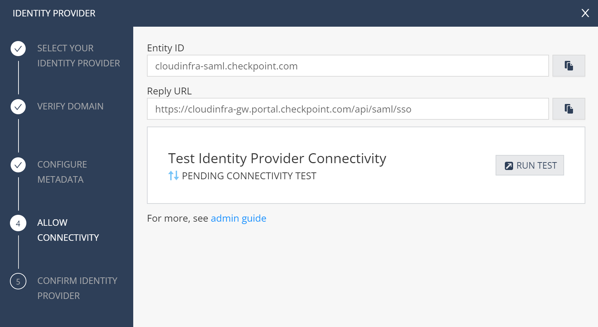

* do not test yet - move to KeyCloak console
* under Clients - add new client
    * Client ID - this is **Entity ID** from Harmony Connect
    * Client Protocol - choose **SAML**
    * Client SAML Endpoint - this is **Reply URL** from Harmony Connect
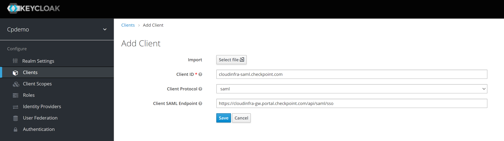

* Save new client and continue in it
    * Valid Redirect URIs: add **https://cloudinfra-gw.portal.checkpoint.com/api/saml/sso**
    * Client Signature Required: **off**
    * Save

* Under this client / Mappers - Create new mapper for UserId
    * Name: **userId**
    * Mapper Type: **User Attribute**
    * User Attribute: **username**
    * Friendly Name: **userId**
    * SAML Attribute Name: **userId**
    * SAML Attribute NameFormat: **Basic**
    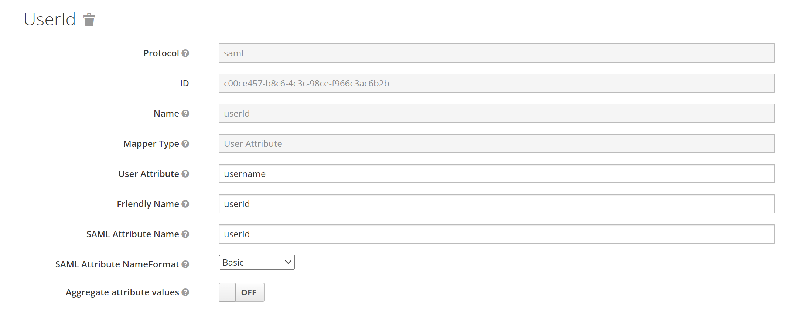

* Under this client / Mappers - Create new mapper for Groups
    * Name: **groups**
    * Mapper Type: **Group list**
    * Group attribute name: **groups**
    * Friendly Name: **groups**
    * SAML Attribute NameFormat: **Basic**
    * Full group path: **off**
    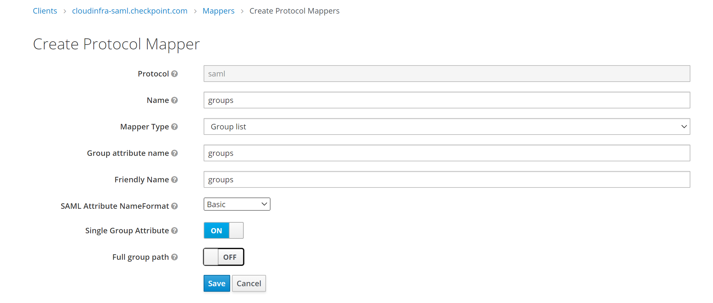

* Test group and user
    * Add test group in KeyCloak - e.g. **hc-app1**
    * Add test user in KeyCloak - e.g. **a@ra.kloud.online**
        * Add user to the group (**hc-app1**)
    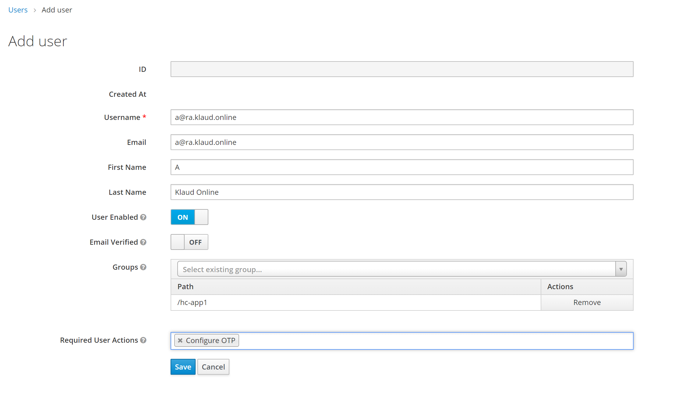
* Set user's password - on User a@ra.klaud.online / Credentials

* Back in Harmomy CONNECT - click **RUN TEST**
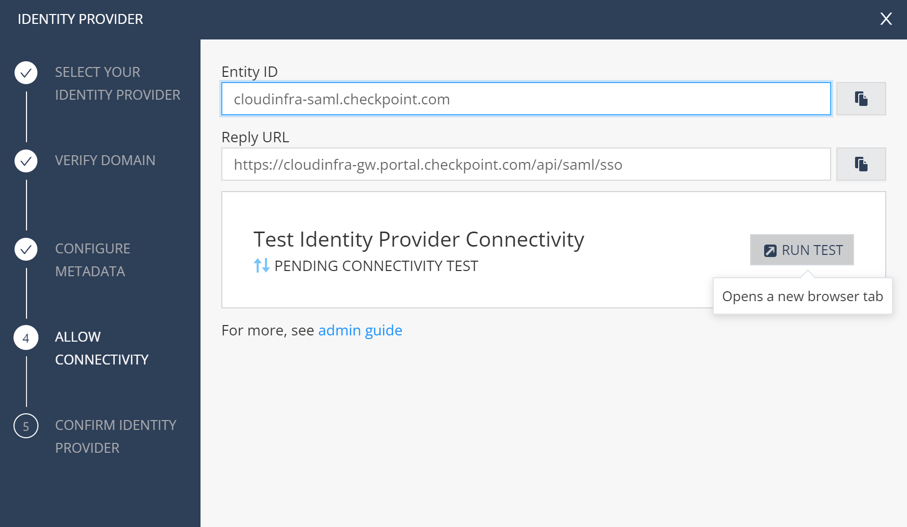
    * Login as user and see test result

* Celebrate passing integration test
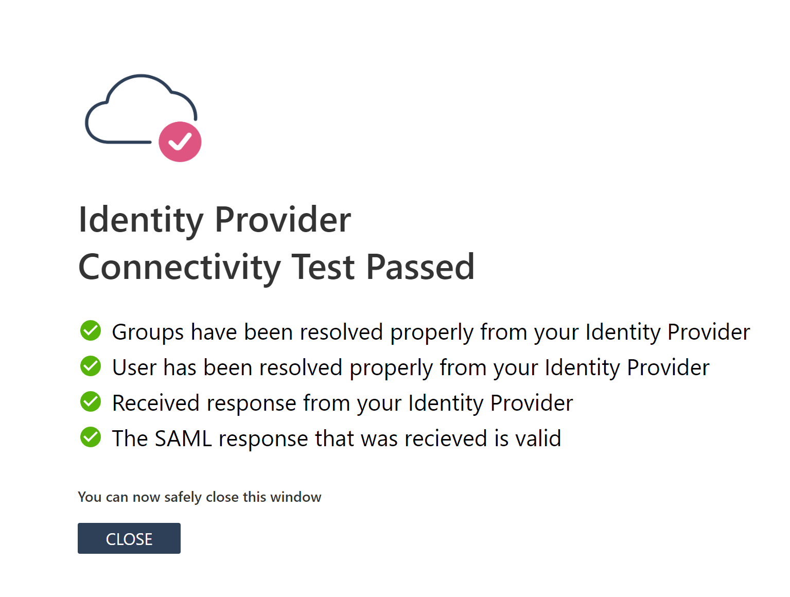

* Finish configuration wizard and add Identity Provider

* Test your integration with real Harmony Connect porrtal
under [Getting Started / Corporate Access](https://portal.checkpoint.com/dashboard/connect#/getting-started) -> Visit user app portal
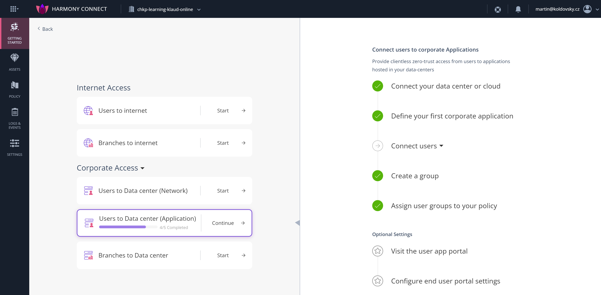

* Confirm user
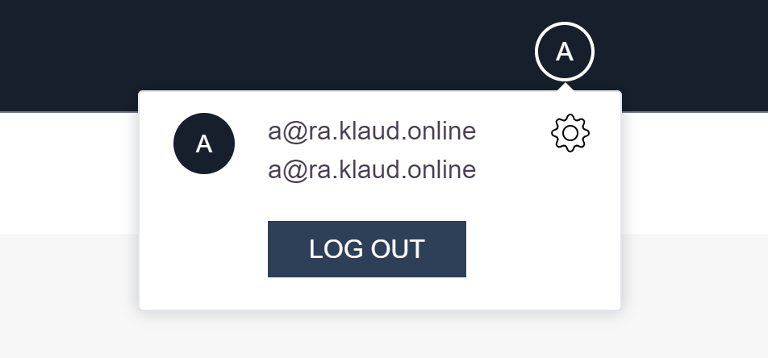

### Tools

[SAML Tracer](https://chrome.google.com/webstore/detail/saml-tracer/mpdajninpobndbfcldcmbpnnbhibjmch) browser extension might be helpful during troubleshooting process